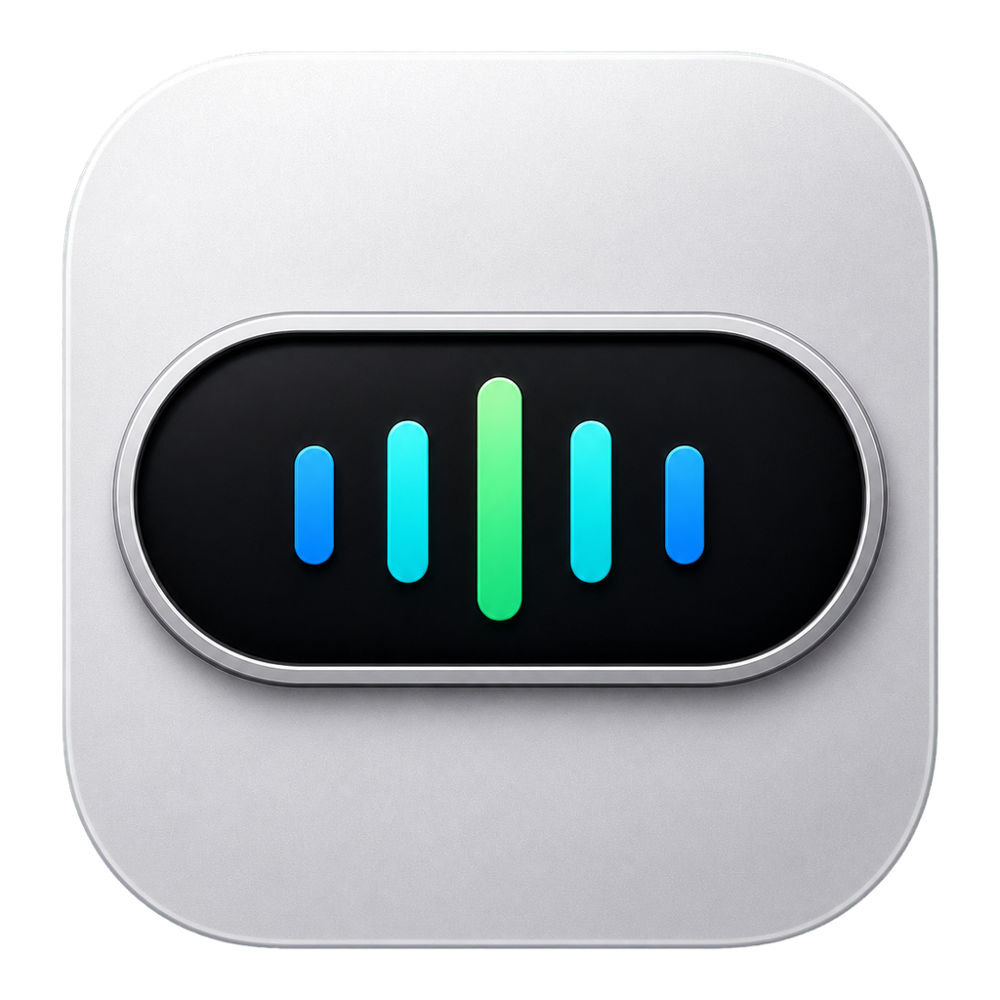

[中文](README-zh.md) | **English**

# AtomVoice

<p align="center"></p>

A lightweight macOS menu bar voice input app. Hold **Fn** to record, release to inject transcribed text into any focused input field.

  

---

### 🔒 Privacy First
All speech recognition runs **on-device** via Apple's Speech Recognition framework. No audio is ever sent to any server unless you explicitly enable LLM Refinement.

### ⚡ Lightweight
~3 MB app bundle. Near-zero CPU when idle. No background daemons.

---

## Features

- **Hold Fn** to record, release to inject text into any input field
- **Streaming transcription** — Apple Speech Recognition, default Simplified Chinese
- **5-band FFT spectrum waveform** — 100–6000 Hz, low→high left→right, driven by Accelerate framework
- **Auto punctuation** — local rule engine adds sentence-ending marks, no internet required
- **LLM Refinement** — OpenAI-compatible API corrects mis-transcribed terms (e.g. 配森→Python); 9 preset providers + fully editable custom list
- **Dynamic Island animation** — real spring physics at 120 Hz with Gaussian blur; shimmer sweep during refinement
- **Dark/Light mode** — Liquid Glass on macOS 26, Visual Effect blur on older systems
- **5 UI languages** — 简体中文, 繁體中文, English, 日本語, 한국어
- **CJK IME compatible** — auto-switches to ASCII input source before paste

## Requirements

- macOS 13 Ventura or later
- Permissions required: **Accessibility**, **Microphone**, **Speech Recognition**

## Installation

**From Release (recommended)**

Download from [Releases](https://github.com/BlackSquarre/AtomVoice/releases), unzip, drag to Applications.

**Build from source**

```bash
git clone https://github.com/BlackSquarre/AtomVoice.git
cd AtomVoice
make install
```

## ⚠️ Gatekeeper Warning

Ad-hoc signed (not notarized). On first open:

1. Right-click `AtomVoice.app` → **Open** → click **Open**
2. Or go to **System Settings → Privacy & Security** → **Open Anyway**
3. Or run: `xattr -cr /Applications/AtomVoice.app`

## Usage

| Action | Result |
|--------|--------|
| Hold Fn | Start recording |
| Release Fn | Stop and inject text |
| Menu bar icon | Switch language / animation / LLM settings |

## LLM Refinement Setup

Menu bar → **LLM Refinement** → **Settings** — select a provider preset or add your own, enter API key and model name.

Built-in presets: OpenAI / DeepSeek / Moonshot (Kimi) / Qwen / GLM / Yi / Groq / Ollama (local)

## Build Commands

```bash
make build    # Build .app bundle
make run      # Build and launch
make install  # Install to /Applications
make release  # Build Universal + AppleSilicon + Intel packages
make clean    # Clean build artifacts
```

## Project Structure

```
Sources/AtomVoice/
├── AppDelegate.swift          # App entry, recording pipeline
├── FnKeyMonitor.swift         # Global Fn key monitoring (CGEvent tap)
├── AudioEngine.swift          # AVAudioEngine + FFT band analysis
├── SpeechRecognizer.swift     # Apple Speech Recognition streaming
├── CapsuleWindow.swift        # Floating capsule (NSPanel + spring animation)
├── WaveformView.swift         # Spectrum waveform (sine-wave driven)
├── PunctuationProcessor.swift # Local auto-punctuation engine
├── LLMRefiner.swift           # OpenAI-compatible API refinement
├── TextInjector.swift         # Clipboard injection + IME switching
├── MenuBarController.swift    # Menu bar
├── SettingsWindow.swift       # LLM settings + provider management
├── AboutWindow.swift          # About window
└── Localization.swift         # i18n helper
```

## License

MIT
